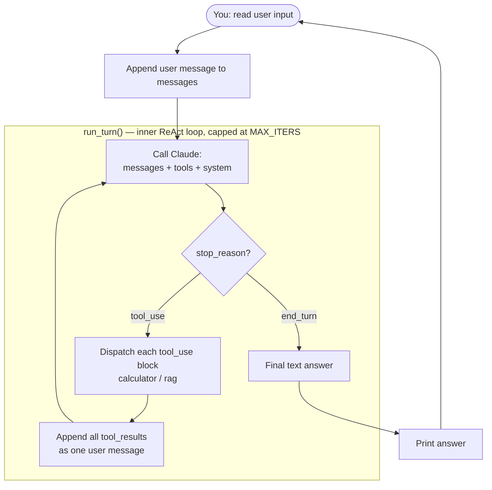

# agent

A ReAct-style (reason → act → observe) LLM agent built from scratch — no LangChain/LangGraph. The agentic loop, tool dispatch, and error handling are hand-rolled directly against the Claude API's tool-use primitives, to understand the mechanics rather than lean on a framework that hides them.

## What it does

An interactive CLI chat session backed by Claude (Haiku 4.5), with two tools:

- **`calculator`** — evaluates arithmetic expressions safely (no `eval`).
- **`rag`** — semantic search over 4,000 arXiv abstracts (machine learning, math, physics, quantitative finance), stored and retrieved through the hand-built [`vdb`](https://github.com/CollinPhipps/vector-database) project.

```bash
uv run agent
```

## Architecture



Two loops, deliberately separated:

- **The inner loop (`run_turn`)** is the actual ReAct mechanism — it keeps calling the API and dispatching tools until Claude produces a plain-text answer (`stop_reason != "tool_use"`), capped at `MAX_ITERS` so a confused model can't loop forever.
- **The outer loop (`main`)** is ordinary multi-turn chat — because the Claude API is stateless, the same `messages` list just keeps growing across user turns, which gives the agent conversational memory "for free" once the tool-use plumbing already requires carrying full history forward.

**The mechanical cycle**, concretely:

1. Send `messages` + `tools` (schemas) + `system` to `client.messages.create(...)`.
2. If `response.stop_reason == "tool_use"`, `response.content` contains one or more `tool_use` blocks (`{name, input, id}`). Append the assistant's response to `messages` verbatim.
3. Execute each requested tool locally, wrap the result as `{"type": "tool_result", "tool_use_id": ..., "content": ...}`. All results from one assistant turn go into a **single** user message (required when Claude makes parallel tool calls in one turn).
4. Call again with the extended history. Repeat until `stop_reason == "end_turn"`.

**Error handling:** each tool dispatch is wrapped in `try/except`; a failure returns `{"is_error": True, "content": str(e)}` as the tool result instead of crashing the process, so a bad tool call is something Claude can see and react to, not a fatal error.

## Tools

### `calculator`

```json
{
  "name": "calculator",
  "description": "Evaluate a basic arithmetic expression. Use this for any numeric computation instead of computing it yourself.",
  "input_schema": {
    "type": "object",
    "properties": {
      "expression": {"type": "string", "description": "e.g. \"12 * (7 + 3)\""}
    },
    "required": ["expression"]
  }
}
```

Deliberately **not** implemented with `eval()`. `eval()` would run any Python expression, not just arithmetic — and since the expression string is ultimately model-generated (and, once RAG is in the mix, indirectly influenced by whatever text got retrieved), a raw `eval()` is a real prompt-injection-to-code-execution vector, not just a style concern. Instead, `Calculator` parses the expression into a Python AST (`ast.parse(..., mode='eval')`) and walks it with an explicit allowlist of node types (`BinOp`, `UnaryOp`, `Constant`, and a fixed set of operators) — anything else (`Call`, `Name`, `Attribute`, ...) hits `generic_visit` and raises. Default-deny by construction, not a blocklist. It also guards against resource exhaustion from something like `9**9**9**9` (exponent and result-size caps in `safe_pow`).

### `rag`

```json
{
  "name": "rag",
  "description": "Use this for finding answers to questions to research papers on the topics of machine learning, artificial intelligence, quantitative finance, physics, and math. Returned from this are the top k results of a search over a vector database containing abstracts of papers from all of these topics. You are to look at the scores and metadata and determine the relevancy yourself. If nothing seems relevant, say you were unable to find anything relevant.",
  "input_schema": {
    "type": "object",
    "properties": {
      "query": {"type": "string", "description": "e.g. \"What are some recent papers on optimization techniques for reinforcement learning?\""},
      "k": {"type": "integer", "description": "Number of results to return. Defaults to 3 if not specified."}
    },
    "required": ["query"]
  }
}
```

**Corpus:** 4,000 abstracts pulled via the `arxiv` package across 8 categories chosen for topical diversity — `cs.LG`, `cs.NA`, `cs.DM`, `math.FA`, `math.PR`, `physics.optics`, `quant-ph`, `q-fin.ST` — so retrieval has to actually discriminate between distinguishable topics rather than picking among near-duplicates.

**Embedding:** each abstract is one chunk (short enough to need no further splitting), embedded with `sentence-transformers/all-MiniLM-L6-v2` (384-dim). This is the one component in the whole project *not* built from scratch — a from-scratch embedding model is its own multi-week project, and here embeddings are a means to demonstrate the RAG-tool pattern, not the thing being studied. Embeddings are cached to disk (`embed.npy` + `metadata.json`, index-aligned) so the 4,000-abstract corpus isn't re-encoded on every run.

**Storage/retrieval:** the flat (brute-force) `VectorStore` from the hand-built [`vdb`](https://github.com/CollinPhipps/vector-database) project, pulled in as a git dependency (pinned to a specific commit in `pyproject.toml`) rather than duplicated into this repo. At this scale flat cosine search is comfortably sub-millisecond, so there's no need for the HNSW/IVF indexes `vdb` also implements — those exist to solve a scaling problem this demo doesn't have.

**Relevance — a deliberate design decision.** `flat_search` is a pure k-nearest-neighbor search: it always returns the `k` closest vectors that exist in the store, with no concept of "good enough." An early version tried to fix this with a hard cosine-similarity threshold, but general-purpose sentence embeddings are known to produce a compressed similarity range (even near-duplicate text tops out well below 1.0 with this model), so a single global cutoff is a fragile, hard-to-calibrate heuristic. The chosen fix instead: return the top-`k` results **with their similarity scores**, and instruct Claude (via the tool description and system prompt) to judge relevance itself by reading the actual abstract text — offloading the judgment to the part of the system that can actually read, instead of a brittle numeric proxy. See the third worked trace below for empirical scores that validate this: a genuinely relevant match scored `0.54`, a genuinely irrelevant one scored `0.20` — a real gap exists, but picking a universal number to sit in it would still be guesswork.

## System prompt

```
You are a research assistant with access to two tools: a calculator for
arithmetic, and a search tool over a database of research paper abstracts
(machine learning, math, physics, and quantitative finance).
Use the calculator instead of doing arithmetic yourself.
Use the search tool for questions about research topics or papers instead
of answering from memory.
When you get search results back, cite the specific paper titles you're
drawing from. If the search tool returns no relevant results, say so
plainly rather than guessing or making something up.
```

## Worked traces

All three captured from a single live run against `claude-haiku-4-5`, in one continuous conversation.

### 1. Grounded RAG retrieval

```
USER: What are some recent papers on the Bethe-Hessian matrix?

  -> TOOL CALL: rag({"query": "Bethe-Hessian matrix", "k": 5})
  <- TOOL RESULT: [{"score": 0.5403, "metadata": {"abstract": "The Bethe-Hessian is a
     symmetric matrix for which the negative spectrum has been observed to encode the
     informative structure of sparse stochastic block models. We prove that...", "title":
     "The Bethe-Hessian down to the Percolation Threshold", ...}, ...]

CLAUDE: Based on the search results, I found a highly relevant recent paper on the
Bethe-Hessian matrix:

**"The Bethe-Hessian down to the Percolation Threshold"** - This paper directly focuses
on the Bethe-Hessian matrix and provides theoretical results about its spectrum. The
paper proves that in the stochastic block model where all vertices have expected degree
d > 1, the number of negative eigenvalues of the Bethe-Hessian exactly matches the number
predicted by the eigenvalues of the planted model lying outside the bulk spectrum...
```

Claude correctly identifies and cites the single most relevant paper out of 5 retrieved candidates, rather than treating "returned by search" as "equally relevant."

### 2. Calculator, chained arithmetic

```
USER: What's 47 * 89, then divide that result by 2 and add 10?

  -> TOOL CALL: calculator({"expression": "(47 * 89 / 2) + 10"})
  <- TOOL RESULT: 2101.5

CLAUDE: The answer is **2101.5**.
To break it down:
- 47 × 89 = 4,183
- 4,183 ÷ 2 = 2,091.5
- 2,091.5 + 10 = 2,101.5
```

Notable: rather than making three separate tool calls (one per operation), Claude collapsed the whole multi-step calculation into a single arithmetic expression and one tool call. The loop *supports* multiple round trips per turn (the `MAX_ITERS` loop keeps going as long as `stop_reason == "tool_use"`), but nothing forces it — a capable model will often just do the composition itself and call the tool once. Worth knowing this going in: a single-tool-call trace doesn't by itself prove multi-step looping works, since the model may simply not have needed it.

### 3. Honest failure on an out-of-domain query

```
USER: Do you have anything in the database about medieval agriculture?

  -> TOOL CALL: rag({"query": "medieval agriculture", "k": 5})
  <- TOOL RESULT: [{"score": 0.1979, "metadata": {"abstract": "The long-run convergence
     of developing economies toward advanced countries exhibits robust empirical
     regularities...", ...}, ...]

CLAUDE: No, I was unable to find anything relevant about medieval agriculture in the
database. The search results returned papers on topics like technological transfer in
modern economies, fish and meat processing, scheduling algorithms, resource extraction,
and financial markets—none of which relate to medieval agriculture.

The database I have access to is focused on machine learning, artificial intelligence,
quantitative finance, physics, and mathematics, so historical topics like medieval
agriculture fall outside its scope.
```

This is the trace that validates the "let Claude judge relevance" design decision: the top score for a genuinely unrelated query (`0.198`) is meaningfully lower than the genuinely relevant match above (`0.540`), and Claude correctly refuses to fabricate an answer rather than picking the "closest" (but irrelevant) result and pretending it's useful.

## Setup

```bash
cp .env.example .env   # fill in ANTHROPIC_API_KEY
uv sync
uv run agent
```

`vdb` is pulled in automatically by `uv sync` (a pinned git dependency — see `pyproject.toml`), no separate clone needed. You'll also need a `corpus.json` + cached `embed.npy`/`metadata.json`, built via `agent.tools.rag.create_corpus()` / `load_database_fresh()`.

## What I'd improve next

- **Retrieval-tuned embeddings.** `all-MiniLM-L6-v2` is a general sentence-similarity model, not trained for query-vs-document retrieval specifically — a model fine-tuned on query/document contrastive pairs (e.g. an MS MARCO–tuned sentence-transformer) would likely produce a more separated, more calibratable similarity distribution.
- **Persist conversation history across CLI sessions**, not just within one running process.
- **HNSW/IVF at a larger corpus size** — flat search is the right choice at 4,000 vectors, but swapping in the hand-built HNSW index from `vdb` at, say, 100K+ chunks would be a natural way to demonstrate why that project's work exists.
